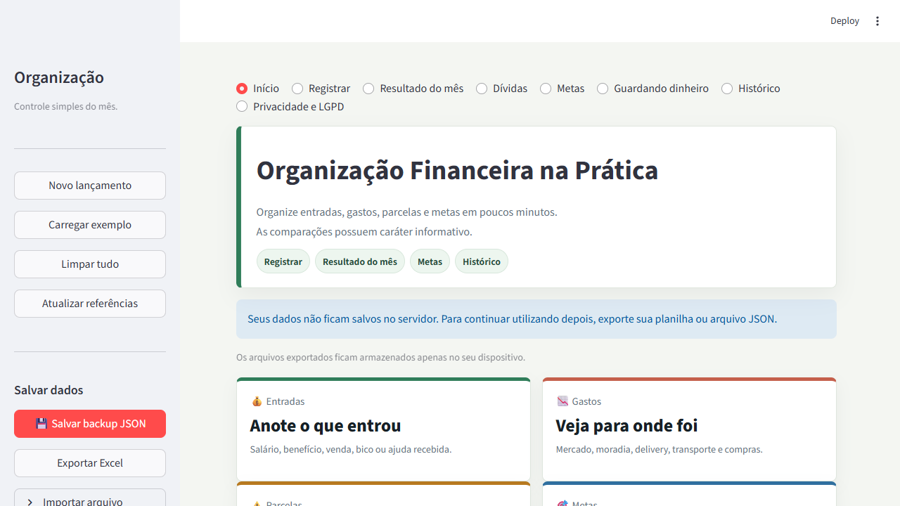
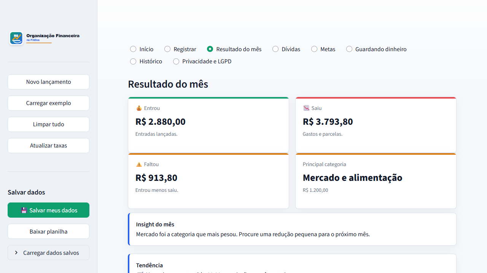

# Organização Financeira na Prática

Aplicativo em Python com Streamlit para organizar entradas, gastos, dívidas, metas e histórico financeiro de forma simples, local e educativa.

O projeto foi pensado para uso cotidiano, sem login, banco de dados ou coleta de informações sensíveis. No Streamlit Cloud, os dados ficam na sessão temporária e em uma cópia automática no localStorage do navegador; o usuário também pode baixar backup JSON ou planilha Excel no próprio dispositivo.

## Screenshots





## Funcionalidades

- Registro de entradas e gastos do mês.
- Separação entre gastos fixos, variáveis e compras parceladas.
- Painel simples com entrou, saiu, sobrou/faltou e principal categoria.
- Insight contextual do mês e comparação com o mês anterior por categoria.
- Cadastro de dívidas com total restante, parcelas do mês e parcelas restantes.
- Metas múltiplas para guardar dinheiro, com progresso, prioridade e simulação de evolução mensal.
- Histórico anual com resumo mês a mês e categorias principais.
- Exportação em Excel, PDF visual e JSON.
- Importação de backup JSON ou Excel exportado pelo próprio app.
- Salvamento automático no navegador para resistir a F5 ou queda de conexão.
- Política de Privacidade e LGPD dentro do aplicativo.

## Tecnologias

- Python
- Streamlit
- Pandas
- Plotly
- OpenPyXL

## Arquitetura

O app fica concentrado em `app.py` porque o projeto é pequeno e acadêmico, mas o código é separado por funções:

- normalização de lançamentos, dívidas e configurações;
- cálculo de receitas, gastos, saldo, metas e simulações;
- geração de histórico anual;
- exportação e importação local;
- telas do Streamlit;
- componentes visuais reutilizáveis.

Modelo de funcionamento:

```text
Usuário -> Streamlit Cloud -> Sessão temporária -> localStorage do navegador -> Backup local do usuário
```

Não há autenticação, banco de dados, armazenamento permanente em servidor ou integração com serviços financeiros.

## Privacidade e LGPD

O aplicativo não solicita CPF, senha, dados bancários, cartão de crédito ou documentos pessoais.

As informações digitadas são usadas para calcular e exibir os resultados. Uma cópia automática fica no localStorage do navegador do usuário, e os arquivos exportados ficam exclusivamente no dispositivo escolhido pelo usuário.

A política completa está em `PRIVACIDADE_LGPD.md` e também na aba **Privacidade e LGPD** do app.

## Exportação e importação

O usuário pode baixar:

- `controle-financeiro-AAAA-MM.json`, recomendado como backup principal;
- `controle-financeiro-AAAA-MM.xlsx`, recomendado para análise em planilha;
- `controle-financeiro-AAAA-MM.pdf`, recomendado para resumo visual.

Para restaurar, basta carregar no app um JSON ou Excel exportado anteriormente. Após a importação, o aplicativo mostra um resumo visual com quantidade de lançamentos, dívidas, meta encontrada e período dos dados.

## Como executar

Instale as dependências:

```bash
pip install -r requirements.txt
```

Execute:

```bash
streamlit run app.py
```

Normalmente o app abre em:

```text
http://localhost:8501
```

No Windows, também é possível abrir pelo arquivo:

```text
executar_app.bat
```

## Deploy no Streamlit Cloud

Estrutura mínima do repositório:

```text
app.py
requirements.txt
README.md
PRIVACIDADE_LGPD.md
docs/screenshots/
```

Passos:

1. Subir os arquivos para um repositório no GitHub.
2. Acessar [Streamlit Cloud](https://share.streamlit.io).
3. Conectar a conta do GitHub.
4. Selecionar o repositório.
5. Informar `app.py` como arquivo principal.
6. Publicar.

## Testes finais sugeridos

- Exportar Excel, JSON e PDF.
- Importar JSON e Excel.
- Atualizar a página com F5 e confirmar que os dados voltam automaticamente.
- Testar a restauração depois de limpar os dados.
- Conferir tabelas, gráficos, sidebar e botões em tela mobile.
- Validar se os nomes dos arquivos aparecem com ano e mês.
- Confirmar que o backup JSON baixa corretamente antes de encerrar a sessão.

## Identificação

- **Responsável:** Yohann da Rocha Risso
- **Projeto:** Organização Financeira na Prática
- **Instituição:** PUC Minas - Ciências Econômicas EaD
