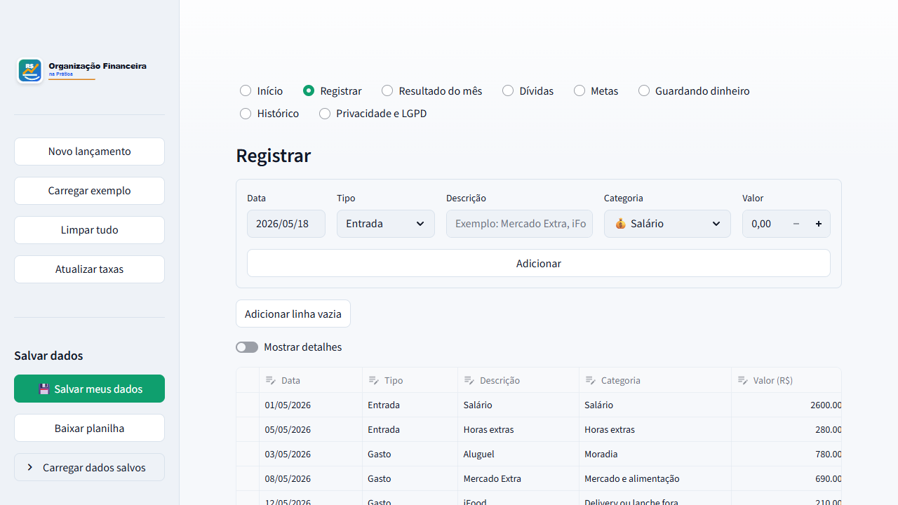
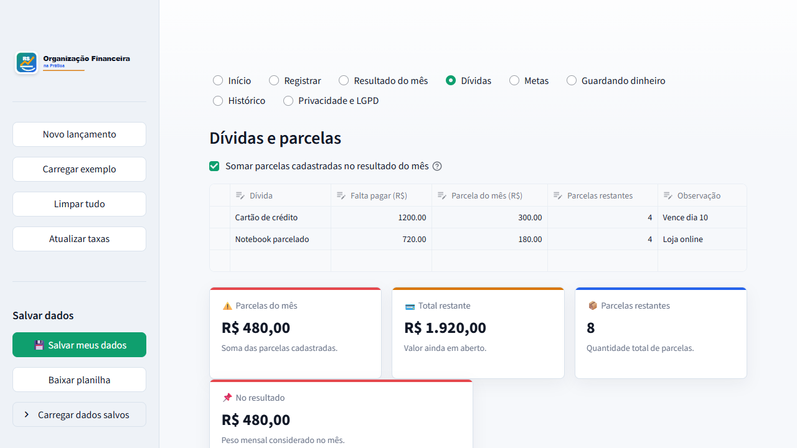
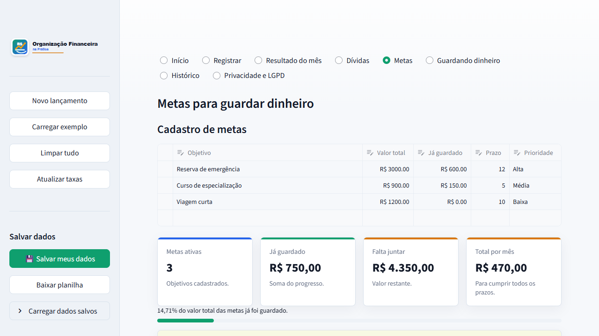
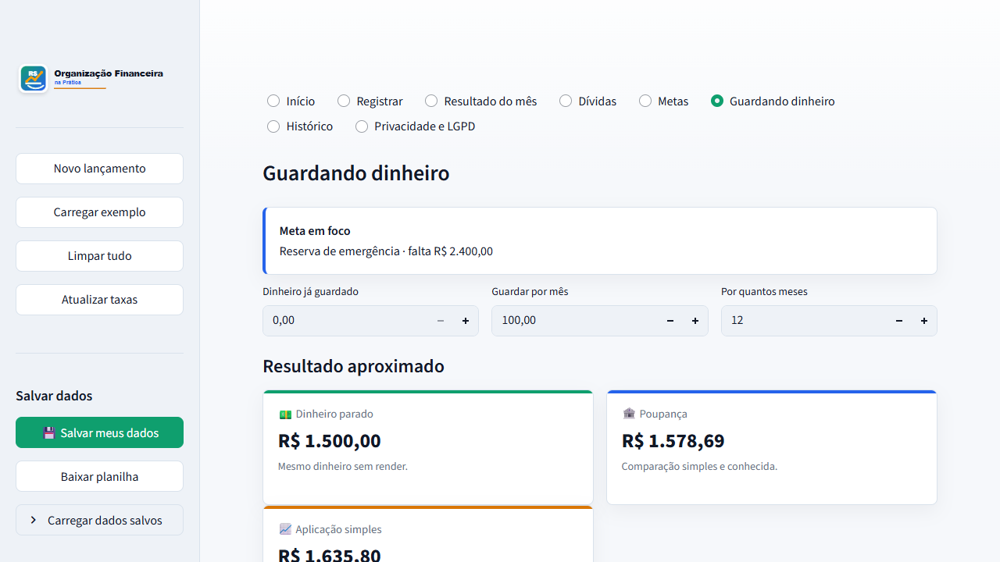
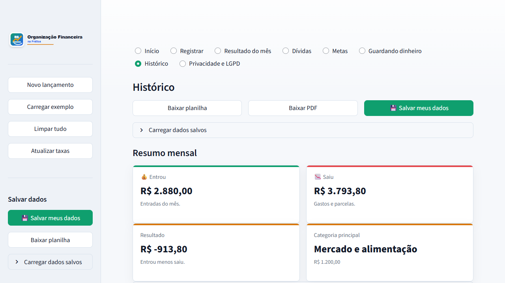
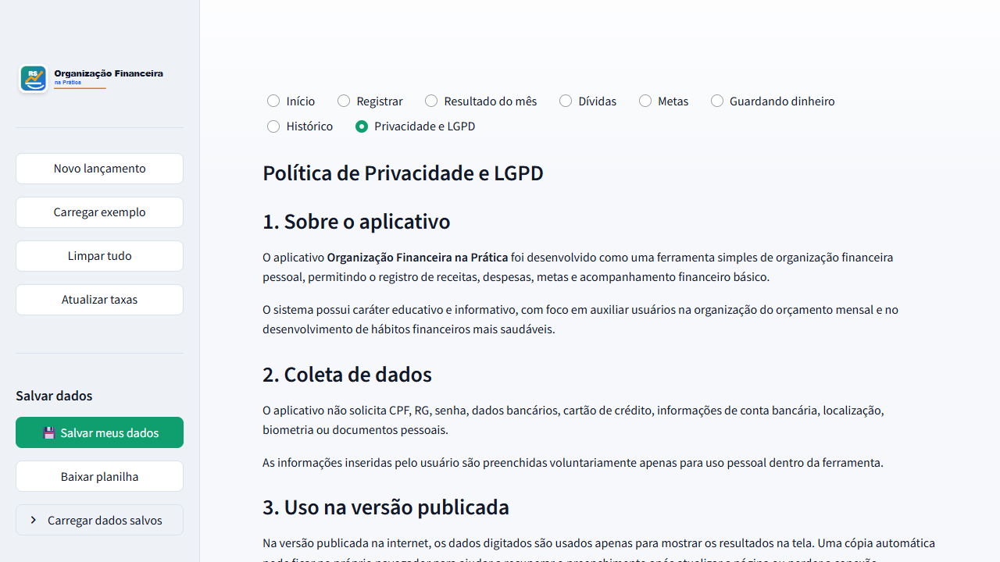

# Documentação de funcionamento do app

Registro visual da simulação feita no app **Organização Financeira na Prática** em 18/05/2026.

## Cenário simulado

A simulação foi feita pelo botão **Carregar exemplo**, usando os dados fictícios já definidos no próprio app:

- entradas do mês, como salário e horas extras;
- gastos fixos e variáveis, como aluguel, mercado, transporte, internet e assinaturas;
- compras parceladas e dívidas do mês;
- metas financeiras com prioridades e prazos;
- simulação de dinheiro guardado ao longo do tempo.

## Telas registradas

### 1. Início

Apresenta a proposta do aplicativo e os principais módulos de uso.

### 2. Registrar

Mostra o cadastro rápido de entradas e gastos, a tabela editável e o resumo por categoria.

### 3. Resultado do mês

Exibe o total que entrou, saiu, o saldo final, a principal categoria de gasto e o mapa do mês.

### 4. Dívidas

Registra dívidas e parcelas, mostrando o total restante, parcelas do mês e impacto no resultado.

### 5. Metas

Permite acompanhar objetivos financeiros, valores já guardados, prazos e progresso de cada meta.

### 6. Guardando dinheiro

Simula a evolução do dinheiro guardado, comparando dinheiro parado, poupança e aplicação simples.

### 7. Histórico

Reúne exportações, resumo mensal, evolução anual e relatórios de apoio.

### 8. Privacidade e LGPD

Documenta a política de privacidade, o tratamento local dos dados e as limitações do app.

## Resultado da simulação

O fluxo confirmou que as principais abas carregam com dados de demonstração e exibem indicadores, gráficos, tabelas editáveis, botões de exportação e informações de privacidade para apresentação do funcionamento do app.
